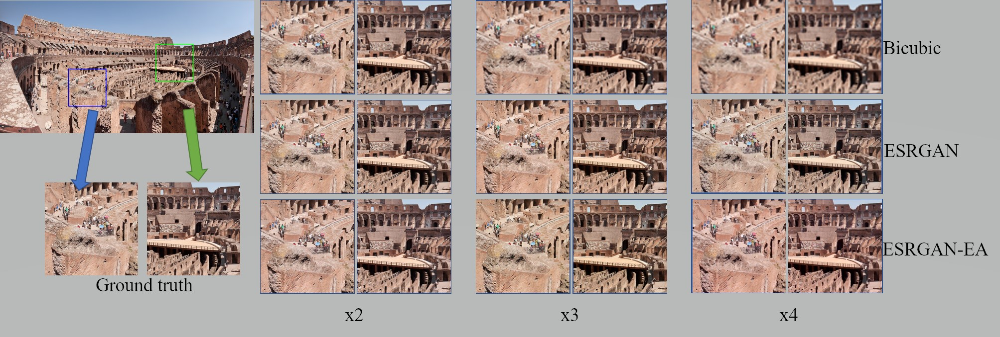
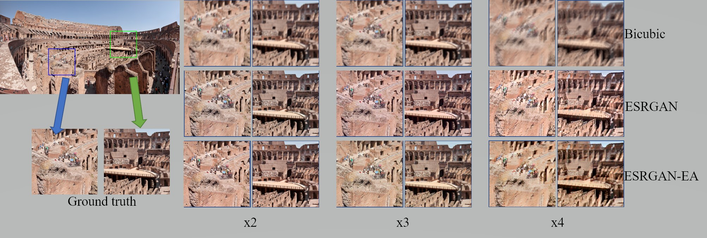

# AMLSII_assignment ELEC0135 20/21 

 The task of this assignment is to complete track 1 and track 2 of the New Trends in Image Restoration and Enhancement (NTIRE) challenge on example-based single image super-resolution. The model used is a modified version of ESRGAN. ESRGAN enhances the SRGAN  model with the Residual-in-Residual Dense Block (RRDB) without batch normalization and the idea of relativistic GAN  to reconstruct more realistic and natural super-resolution images. However, the perceptual loss is heavily made up of the losses computed from the neural networks, feature loss, and discriminator loss, which are features in the black-box, and whether these features can effetely capture the high-frequency details of the images is still a question. In this assignment,the ESRGAN edge-assisted model (ESRGAN-EA) is proposed, where the soft edge loss is used as a component of the generator loss, which can explicitly direct the model to learn edge information from the images. The results show that the reconstructed SR images generated by the edge-assisted model have fewer artifacts compared to ESRGAN, especially in track 2.

# Visual results for the assignment

## Track 1: Bicubic 



## Track 2:Unknown



# Acknowledge

Code used in this assignment is modified in the base of [Github: peteryuX/esrgan-tf2](https://github.com/peteryuX/esrgan-tf2) and follow the MIT license.

# Installation

Create a new python virtual environment by [Anaconda](https://www.anaconda.com/)  and use the pip tool to install dependent  libraries.

## Clone this repository

```
git clone https://github.com/WeichenLi2020/AMLSII_assignment20_21.git
```

## Create virtual environment

```
conda create -n esrgan-ea python=3.6
conda activate esrgan-ea
```

## Install dependent libraries

```
conda install --yes --file requirements.txt
```

# Dataset download

Download [DIV2K dataset](https://data.vision.ee.ethz.ch/cvl/DIV2K/) Track 1 and track 2 training dataset and validation dataset. Put the "DIV2K" folder into the "data" folder in this repository.

# Run the code

The function of file `main.py`  is to train both ESRGAN and ESRGAN-EA models for tasks in track 1 and track 2. The test results will automatically save in the folder "results".

```
python main.py # train and test models
```

# Weight reuse

If you want to accelerate the training progress by reuse the pre-trained model in [Github: peteryuX/esrgan-tf2](peteryuX/esrgan-tf2), download the pre-trained model in [ESRGAN](https://drive.google.com/file/d/1Nnob9TIAL1f6ef2C_YnS97KxM91bmE0_/view?usp=sharing) and unzip the file into folder "./track1_bicubic/checkpoints" or "./track2_unknown/checkpoints" before training.

# Structure of repository

│  LICENSE # MIT LICENSE of repository https://github.com/peteryuX/esrgan-tf2  
│  main.py # Train and test ESRGAN and ESRGAN-EA models for all tasks  
│  README.md # Read-me file  
│  requirements.txt # Python environment dependency file  
│    
├─data  
│  │  extract_subimages.py 			# Data preprocess: Crop images    
│  │  png2tfrecord.py 					  # Convert cropped images into tfrecord file    
│  │      
│  └─DIV2K  
│      ├─DIV2K_train_HR 							  # DIV2K training HR images  
│      ├─DIV2K_train_LR_bicubic 			    # DIV2K training bicubic LR images  
│      │  ├─X2 												# bicubic x2 downgraded images  
│      │  ├─X3 												# bicubic x3 downgraded images  
│      │  └─X4 												# bicubic x4 downgraded images  
│      ├─DIV2K_train_LR_unknown 		   # DIV2K training unknown LR images  
│      │  ├─X2 												# unknown x2 downgraded images  
│      │  ├─X3 												# unknown x3 downgraded images  
│      │  └─X4 												# unknown x4 downgraded images  
│      ├─DIV2K_valid_HR							  # DIV2K validation HR images  
│      ├─DIV2K_valid_LR_bicubic 				# DIV2K validation bicubic LR images  
│      │  ├─X2 												# bicubic x2 downgraded images  
│      │  ├─X3 												# bicubic x3 downgraded images  
│      │  └─X4 												# bicubic x4 downgraded images  
│      └─DIV2K_valid_LR_unknown 			# DIV2K unknown bicubic LR images  
│          ├─X2 												# unknown x2 downgraded images  
│          ├─X3 												# unknown x2 downgraded images  
│          └─X4 												# unknown x2 downgraded images  
├─results 													# Save folder for testing results.  
├─track1_bicubic # Essential codes for track 1  
│  │  result.py 											 # Essential codes for testing  
│  │  train_esrgan_bicubic.py 				  # Essential codes for training ESRGAN  
│  │  train_esrgan_ea_bicubic.py 			# Essential codes for training ESRGAN-EA  
│  │  
│  ├─checkpoints 									  # Checkpoints for training progress  
│  ├─configs 											   # Configuration files for different models  
│  │      esrgan_ea_x2_bicubic.yaml  
│  │      esrgan_ea_x3_bicubic.yaml  
│  │      esrgan_ea_x4_bicubic.yaml  
│  │      esrgan_x2_bicubic.yaml  
│  │      esrgan_x3_bicubic.yaml  
│  │      esrgan_x4_bicubic.yaml  
│  │      
│  ├─logs 													# Logs of training. Require tensorboard to view.  
│  └─modules 										    # Essential codes for training  
│          dataset.py 									  # Essential for processing data  
│          losses.py 										 # Essential for calculating losses  
│          lr_scheduler.py 							  # Essential for learning scheduler  
│          models.py 									  # Essential for building network architecture  
│          utils.py 											# Codes for general tools  
│          __init__.py  
│          
└─track2_unknown 								  # Essential codes for track 1  
    │  result.py  
    │  train_esrgan_ea_unknown.py  
    │  train_esrgan_unknown.py  
    │  
    ├─checkpoints  
    ├─configs  
    │      esrgan_ea_x2_unknown.yaml  
    │      esrgan_ea_x3_unknown.yaml  
    │      esrgan_ea_x4_unknown.yaml  
    │      esrgan_x2_unknown.yaml  
    │      esrgan_x3_unknown.yaml  
    │      esrgan_x4_unknown.yaml  
    │      
    ├─logs  
    └─modules  
            dataset.py  
            losses.py  
            lr_scheduler.py  
            models.py  
            utils.py  
            __init__.py  
            